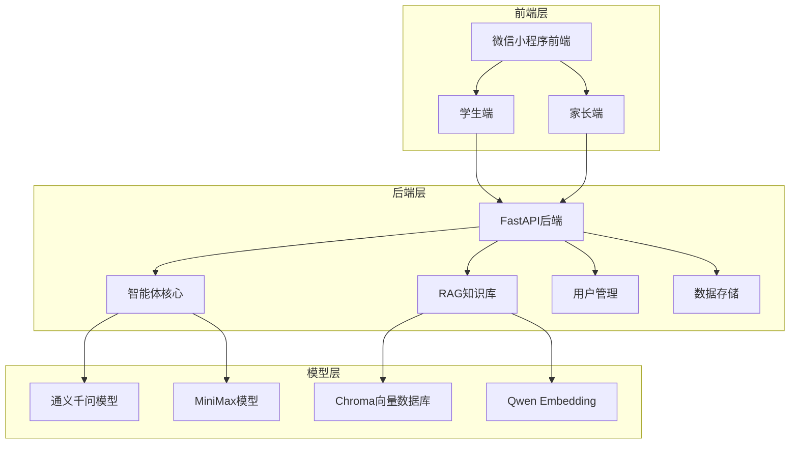

# WarmStudy AI Psychological Support System Project Plan

## 1. 项目背景

### 1.1 问题现状

- **青少年心理健康问题日益严重**：据统计，我国青少年抑郁检出率达24.6%，其中重度抑郁为7.4%
- **传统心理辅导资源不足**：专业心理咨询师数量有限，难以满足庞大的需求
- **隐私和便利性问题**：青少年对传统心理咨询存在抵触情绪，担心隐私泄露
- **家长缺乏专业指导**：家长普遍缺乏心理健康知识，难以有效帮助孩子

### 1.2 项目目标

- **提供智能心理辅导**：基于AI技术，为青少年提供24/7的心理支持
- **构建专业知识库**：整合心理健康领域专业知识，提供科学的心理干预
- **家校协同**：连接学生和家长，共同关注青少年心理健康
- **危机预警**：及时识别高危情绪，提供干预建议

## 2. 技术架构

### 2.1 系统架构

### 2.2 技术栈

| 类别    | 技术             | 版本      | 用途      |
| ----- | -------------- | ------- | ------- |
| 前端    | 微信多端应用         | -       | 跨设备无缝协同 |
| 后端    | FastAPI        | 0.109.0 | API服务   |
| 智能体   | LangChain      | 0.1.4   | 智能体框架   |
| 大模型   | 通义千问           | -       | 对话生成    |
| 大模型   | MiniMax        | 2.7     | 对话生成    |
| 向量数据库 | ChromaDB       | 0.4.22  | 知识库存储   |
| 向量模型  | Qwen Embedding | -       | 文本向量化   |
| 部署    | Docker         | -       | 容器化部署   |

## 3. 功能规划

### 3.1 核心功能

1. **智能对话**：基于大模型的心理辅导对话
2. **知识检索**：RAG增强的专业知识回答
3. **情绪识别**：实时情绪分析和危机预警
4. **用户画像**：基于用户信息和对话历史的个性化服务
5. **家长监控**：家长端查看孩子心理状态
6. **知识库管理**：Web界面管理专业知识

### 3.2 技术亮点

1. **状态机工作流**：基于状态机的智能体工作流程管理
2. **多模态融合**：支持文本、语音等多种输入方式
3. **实时情绪监测**：基于关键词和语义的情绪分析
4. **个性化记忆**：长期记忆存储用户偏好和历史
5. **安全保障**：数据加密和隐私保护

## 4. 项目实施计划

### 4.1 开发阶段

| 阶段    | 时间 | 任务               |
| ----- | -- | ---------------- |
| 需求分析  | 1周 | 功能需求整理，技术方案设计    |
| 后端开发  | 2周 | 核心API开发，智能体实现    |
| 前端开发  | 2周 | 微信小程序界面开发        |
| 知识库构建 | 1周 | 专业知识收集，向量化存储     |
| 测试优化  | 1周 | 功能测试，性能优化        |
| 部署上线  | 1周 | Docker容器化，云服务器部署 |

### 4.2 资源需求

- **开发人员**：1名后端开发，1名前端开发
- **硬件资源**：云服务器1台（4核8G）
- **API密钥**：通义千问、MiniMax API密钥
- **知识库**：心理健康专业资料

## 5. 预期成果

### 5.1 系统功能

- 微信小程序前端，包含学生端和家长端
- 后端智能体服务，支持实时对话
- RAG知识库，包含心理健康专业知识
- 管理后台，支持知识库维护

### 5.2 技术指标

- 对话响应时间：<2秒
- 知识库检索准确率：>85%
- 系统稳定性：99.9%
- 并发处理能力：100用户/秒

## 6. 风险评估

### 6.1 潜在风险

1. **API调用限制**：大模型API可能存在调用频率限制
2. **知识库质量**：专业知识的准确性和完整性
3. **用户隐私**：青少年个人信息保护
4. **系统安全**：防止恶意攻击和数据泄露

### 6.2 应对措施

1. **API管理**：实现请求限流和错误重试机制
2. **知识审核**：专业心理咨询师审核知识库内容
3. **隐私保护**：数据加密存储，匿名化处理
4. **安全防护**：HTTPS加密，防火墙配置

## 7. 项目价值

### 7.1 社会价值

- 缓解青少年心理健康问题
- 提高心理健康服务的可及性
- 促进家校协同，共同关注青少年成长

### 7.2 技术价值

- 展示AI在心理健康领域的应用潜力
- 探索大模型+RAG的智能体架构
- 提供可复制的心理健康服务解决方案

## 8. 结语

WarmStudy智能心理辅导系统通过AI技术为青少年提供专业、便捷的心理健康服务，弥补了传统心理辅导资源的不足。项目采用先进的技术架构，结合专业的心理健康知识，致力于成为青少年心理健康的守护者。

***

**项目团队**：WarmStudy开发团队\
**日期**：2026年4月\
**版本**：v1.0.0
